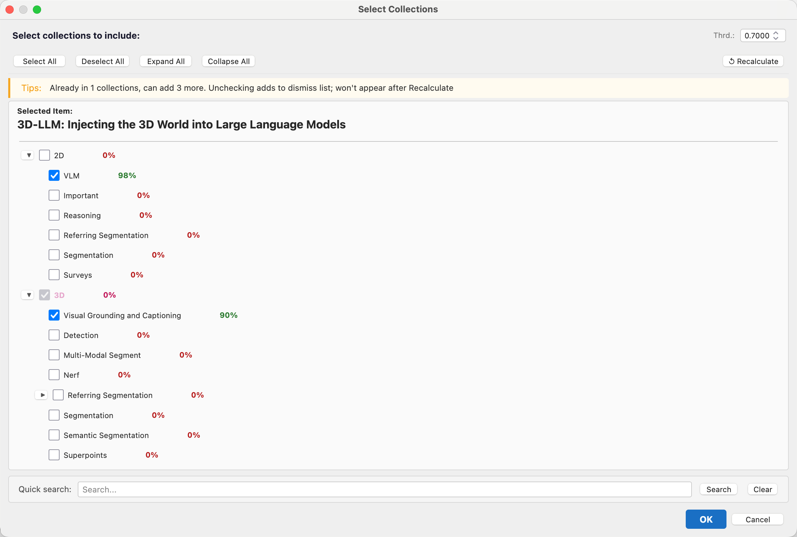

# PaperRouter

**Intelligently route your papers into the right Zotero collections — powered by embeddings and LLM zero-shot classification.**

---

## What it does

PaperRouter is a Zotero plugin that automatically recommends which collections a paper belongs to. Select an item, open the dialog, and PaperRouter ranks your collections by semantic relevance — with confidence scores shown for each. Confirm, adjust, and done.

It learns from your feedback: collections you reject get down-ranked over time.

---

## Key Features

- **Smart recommendations** — semantic similarity via embedding vectors or LLM zero-shot classification
- **Confidence scores** — each collection shows a `Conf:` score so you know how certain the model is
- **Feedback learning** — rejected collections are blacklisted and penalized in future recommendations
- **Hierarchy-aware** — understands parent/child collection relationships; avoids redundant suggestions
- **Quick search** — filter and highlight collections by keyword inside the dialog
- **Configurable limit** — set how many collections a single item can belong to (default: 4)
- **Background pre-computation** — embeddings are updated on startup so the dialog opens fast

---

## How it works

PaperRouter computes semantic similarity between the item title and each collection name using one of two algorithms:

1. **Embedding cosine similarity** — calls an embedding API (OpenAI / Cohere) and scores collections by vector angle, with IDF weighting and specificity penalties applied
2. **LLM zero-shot classification** — sends all collection names to an LLM in a single prompt and parses ranked results with confidence scores

---

## Requirements

- [Zotero](https://www.zotero.org/) 7.x
- An API key from **OpenAI** or **Cohere** (required for embedding / LLM features)

---

## Installation

1. Download `PaperRouter-v1.0.xpi` from [Releases](../../releases)
2. In Zotero: **Tools → Add-ons → ⚙️ → Install Add-on From File**
3. Select the `.xpi` file and restart Zotero

---

## Configuration

1. Open **Edit → Preferences → PaperRouter**
2. Select a provider: **OpenAI** or **Cohere**
3. Enter your **API Key** (and optionally a custom Base URL)
4. Choose a model and click **Test Connection**

> If you have [Zotero GPT](https://github.com/MuiseDestiny/zotero-gpt) installed, PaperRouter will automatically read its API configuration — no need to configure again.

---

## Usage

- **Right-click** any item → **Send to Collection...**
- Or click the **T icon** in the Zotero toolbar

In the dialog:
- Pre-checked items are collections the paper already belongs to (shown in **bold red**)
- Adjust the threshold slider to filter by confidence
- Hit **Retry** to re-rank with your feedback applied, or **OK** to confirm

---

## License

MIT
