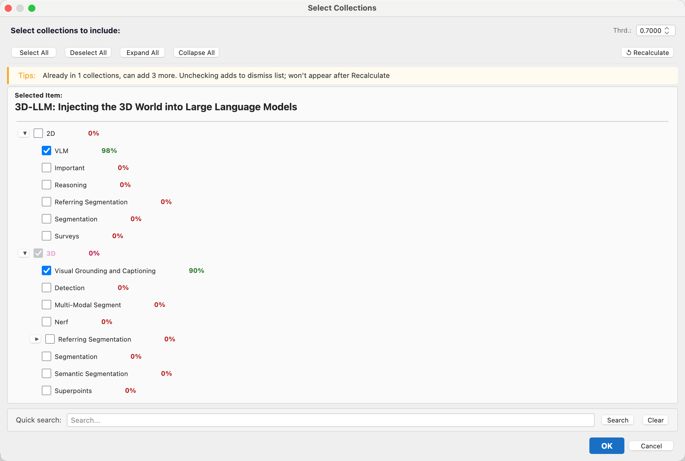

<div align="center">

# PaperRouter

**Smart Zotero collection routing — classify papers into the right collections using embedding similarity or LLM zero-shot.**

[English](./README.md) · [简体中文](./README.zh-CN.md)



</div>

---

## What it does

PaperRouter is a Zotero 7–9 plugin that recommends which collections a paper belongs to. Select an item, open the dialog, and PaperRouter ranks your collections by semantic relevance — each shown with a confidence score. Confirm, adjust, and done.

It learns from your feedback: collections you reject get down-ranked or blacklisted in future recommendations.

## Key features

- **Two algorithms** — embedding cosine similarity (cheap, fast) or LLM zero-shot classification (slower, sharper).
- **Confidence scores** — every collection shows a `Conf:` score so you know how certain the model is.
- **Feedback-aware ranking** — rejected collections get blacklisted and penalised next time.
- **Hierarchy-aware** — understands parent/child collections; avoids redundant sub-collection suggestions.
- **Quick search** — filter and highlight collections by keyword inside the dialog.
- **Configurable cap** — limit how many collections a single item can belong to (default: 4).
- **Background pre-computation** — embeddings refresh on startup so the dialog opens fast.
- **Multilingual UI** — English / 简体中文 / 繁體中文, with auto-detect.

## How it works

PaperRouter computes semantic similarity between the item title (plus abstract, when available) and each collection name using one of two algorithms:

1. **Embedding cosine similarity** — calls an embedding API and scores collections by vector angle, with IDF weighting and a depth/specificity penalty applied.
2. **LLM zero-shot classification** — sends all collection names to an LLM in a single prompt and parses ranked results with confidence scores.

## Requirements

- [Zotero](https://www.zotero.org/) **7.x – 9.x**
- An API key from at least one supported provider:
  - **LLM**: OpenAI · Anthropic (Claude) · Gemini · OpenRouter · Cohere · Custom (any OpenAI-compatible endpoint)
  - **Embedding**: OpenAI · Cohere · Custom (OpenAI-compatible)

Both sides are independent — you can use embedding only, LLM only, or both.

## Installation

1. Download the latest `paperrouter-*.xpi` from [Releases](../../releases) (or grab `dist/paperrouter-0.0.1.xpi` from this repo).
2. In Zotero: **Tools → Add-ons → ⚙️ → Install Add-on From File…**
3. Pick the `.xpi` file and restart Zotero.

### Build from source

```bash
npm ci
npm test                  # unit + integration suite
./scripts/build-xpi.sh    # produces dist/paperrouter-<version>.xpi
```

## Configuration

1. Open **Edit → Settings → PaperRouter**.
2. Configure at least one side:
   - **Embedding** — pick a provider, paste an API key, choose (or type) a model, click **Test**.
   - **LLM** — same flow.
3. Each provider remembers its own API key + model independently — switching providers won't overwrite the others.

## Usage

- **Right-click** any item → **Send to Collection…**
- Or click the **PaperRouter icon** in the Zotero toolbar.

Inside the dialog:

- Pre-checked rows are collections the paper already belongs to (shown bold red).
- Drag the **threshold slider** to filter low-confidence suggestions.
- Click **Retry** to re-rank with your feedback applied, or **OK** to confirm.

## Versioning

This public repo tracks the user-facing release line, starting at **v0.0.1** (built from internal `3.0.6`). Internal pre-release iteration logs live outside this repo; the public [CHANGELOG.md](./CHANGELOG.md) carries the same change history for transparency.

## License

[MPL-2.0](./LICENSE).
