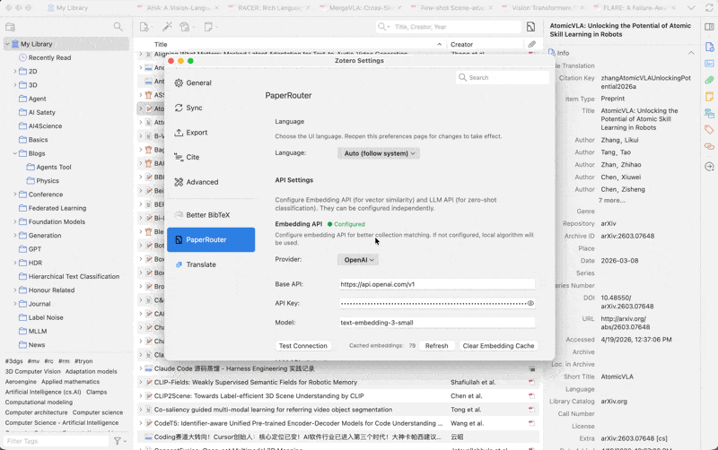

<div align="center">

# PaperRouter

一个帮 Zotero 论文找收藏夹的插件。

[](https://github.com/KESHEN-ZHOU/PaperRouter/stargazers)
[](https://github.com/KESHEN-ZHOU/PaperRouter/releases)
[](./LICENSE)

[English](./README.md) · [简体中文](./README.zh-CN.md)



</div>

---

## 为什么做这个

我的 Zotero 文献库长得比我归档速度快。每来一篇 PDF 都要在 Collection 列表里滚来滚去决定放哪，一半时候干脆扔进 inbox 就忘了。PaperRouter 就是那个 shortcut：右键一篇文章，给你一个排好序的归类建议，一键归档。你拒绝什么它记下来，下一次更准。

## 是什么

在 Zotero 里右键一篇论文，PaperRouter 会列出按语义匹配度排序的收藏夹，每条带置信度，挑合适的勾上就行。被你拒掉的收藏夹会被记住，下次同类条目里那个收藏夹会被降权。

支持 Zotero 7、8、9。

## 功能

- 两种排序模式：向量余弦相似度，或 LLM zero-shot 分类。
- 每个收藏夹标注置信度（`Conf:` 分数）。
- 反馈感知：拒掉的收藏夹下次自动黑名单/降权。
- 层级感知：父收藏夹已经强匹配的时候，不会再重复推荐它下面的子节点。
- 对话框里支持关键词过滤。
- 单条目归类数量可配（默认 4），置信度阈值用滑块调。
- 启动时后台预算 embedding，对话框秒开。
- 界面支持 English / 简体中文 / 繁體中文，可自动跟随系统。

## 工作原理

两条路径，可单用也可叠用：

1. **向量余弦相似度**。调 Embedding API 算向量夹角，再叠加 IDF 权重和层级深度惩罚。
2. **LLM Zero-shot 分类**。把全部收藏夹名一次性塞给 LLM，解析它返回的排序和置信度。

## 环境要求

- [Zotero](https://www.zotero.org/) 7.x – 9.x
- 至少一个 provider 的 API key：
  - LLM：OpenAI、Anthropic (Claude)、Gemini、OpenRouter、Cohere，或任何 OpenAI 兼容端点。
  - Embedding：OpenAI、Cohere，或任何 OpenAI 兼容端点。

两侧互相独立，可以只用 embedding、只用 LLM，或者两个都用。

## 安装

1. 从 [Releases](../../releases) 下载最新 `paperrouter-*.xpi`，或直接用本仓库的 `dist/paperrouter-0.2.0.xpi`。
2. Zotero → 工具 → 插件 → ⚙️ → 从文件安装插件…
3. 选 `.xpi`，重启 Zotero。

### 从源码构建

```bash
npm ci
npm test
./scripts/build-xpi.sh
```

## 配置

打开 **编辑 → 设置 → PaperRouter**，至少配好一侧：

- **Embedding** — 选 provider，填 API key，挑或手输模型名，点 Test。
- **LLM** — 同上。

每个 provider 的 API key 和模型独立保存，切换 provider 不会冲掉别的已存配置。

## 使用

- 右键任意条目 → **发送到分类…**
- 或者点 Zotero 工具栏的 PaperRouter 图标。

对话框里：

- 预先勾选的是该条目已归属的收藏夹（加粗显示）。
- 拖**阈值滑块**过滤低置信度推荐。
- 点 **Retry** 让模型带着新反馈重新排序，点 **OK** 确认归类。

## Roadmap

下一步大概会做的（顺序非承诺）：

- [ ] **Auto-mode**：可选开关，添加新文献到 Zotero 时自动归类，无需打开对话框。
- [ ] **批量模式**：一次跑 N 篇文献，不只是一篇一篇。
- [ ] **整 Collection 排除**：把某个 Collection 标为「永不建议」，不用每次手动拉黑。

进度看 [Issues](../../issues)。

## 许可证

[MPL-2.0](./LICENSE)。
